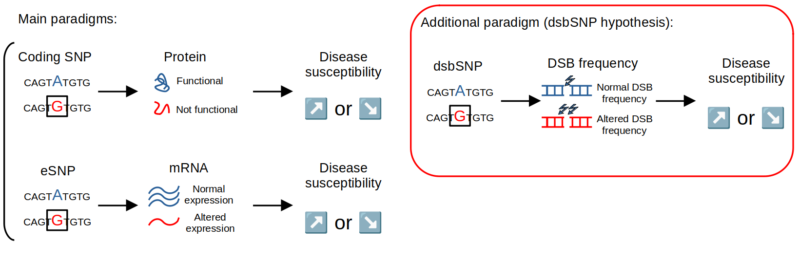

# dsbSNP: Non-coding variants of DNA double-stranded breaks

## Overview

This is the github repository of our paper "A novel class of non-coding variants driving DNA double-strand breaks is associated with complex genetic diseases".

## Data Availability

The dsbSNP bed files (hg19) are available: 
- dsbSNPs_ADASTRA.tsv (for dsbSNPs from Legube's team data)
- dsbSNPs_ADASTRA.tsv (for dsbSNPs extracted from ADASTRA database).

All SNPs including dsbSNPs, but also histone mark SNPs, ATAC-seq SNPs, DRIP-seq SNPs are available here: https://www.data.gouv.fr/datasets/dsbsnp/.

For more SNPs from the ADASTRA database, see: https://adastra.autosome.org/

## Requirements

The scripts were written with R, and need some packages :
```R
library(dplyr)
library(tidyr)
library(corrplot)
library(matsbyname)
library(ggdendro)
library(ggpmisc)
library(ggpubr)
library(RColorBrewer)
library(viridis)
library(ggplot2)
library(plyranges)
library(readr)
library(BSgenome.Hsapiens.UCSC.hg19)
library(reticulate)
library(reshape2)
library(rtracklayer)
library(tidyverse)
library(GenomicRanges)
library(TxDb.Hsapiens.UCSC.hg19.knownGene)
library(data.table)
library(ChIPseeker)
library(ChIPpeakAnno)
library(liftOver)
library(fastDummies)
library(gplots)
library(grDevices)
library(proxy)
library(Rgraphviz)
library(sigminer)
library(seqplots)
library(ggcorrplot)
library(qqman)
library(hexbin)
library(ggupset)
library(ggimage)
library(nVennR)
library(Seurat)
library(Signac)
library(JASPAR2024)
library(TFBSTools)
library(motifmatchr)
library(BRGenomics)
library(parallel)
library(magrittr)
library(universalmotif)
library(memes)
library(clusterProfiler)
library(stringr)
library(pbmcapply)
library(GenomeInfoDb)
library(Matrix)
library(MASS)
library(rlist)
library(poolr)
library(gwascat)
library(psych)
library(rstatix)
library(JASPAR2020)
library(bnlearn)
library(GWASTools)
library(LDlinkR)
library(readxl) 
```

To install Selene, please see: https://github.com/FunctionLab/selene/tree/master

## Scripts

Below are summarized in a table all the scripts for data analysis and plot generation.

| **Folder**     | **Script**                           | **Description** | **Figures** |
|----------------|---------------------------------------|-----------------|-------------|
| **fig3_and_S2** | `script_SNP_ChIP_Legube.R` | Compute dsbSNPs in U2OS from mixalime output / plot annotation / compute number of DSB repair protein supporting a SNP | Figure 3a / Figure S2a |
|                | `script_SNP_ChIP_ADASTRA.R` | Compute dsbSNPs in U2OS from Adastra database / plot annotation | Figure S2c |
|                | `script_merge_Legube_ADASTRA_dsbSNPs.R` | Merge both dsbSNP datasets, will be used for later computations | — |
|                | `get_Av_pr.R` | Compute average profiles | Figure 3c, Figure S2d, Figure S4b, Figure 4a, Figure 5e |
|                | `ES_dsbSNP_scatter heatmap.R` | Compute U2OS dsbSNP pairs panels | Figure S2b |
| **figS3**      | `GC_skew.R` | Compute delta GCskew for both allele of a SNP within a given window | Figure S3c |
|                | `corrplot_and_ES_correlation_hexbin.R` | Compute the correlation matrix and the correlation hexbins between protein binding alterations for SNP from U2OS cell-line | Figure 4c, Figure S3b,e, Figure 4b, Figure S4a |
| **fig4**       | `script_SNP_enrich_eSNP.R` | Test enrichment of dsbSNPs and ctrlSNPs at eSNPs | Figure 4d,e |
| **fig5**       | `enrich_motif_TF.R` | Compute TF motif enrichment at dsbSNPs | Figure 5a |
|                | `motifs_deltascores_function.R` | Compute dsbSNP effect on TF motif score | figure 5b,c,d |
| **fig6**       | `get_harmonized_pval_list.R` | Get GWAS p-values dsbSNP and ctrlSNPs overlapping with GWAS SNPs | — |
|                | `Fisher_test_by_EFO.R` | Compute Fisher test enrichment | — |
|                | `Fisher_barplot.R` | Plot enrichement for diseases associated with dsbSNPs | Figure 6b |
|                | `get_lambda.R` | Compute Lambda score by diseases | Figure S6a |
|                | `get_lambda_bars_and_boxplot.R` | Plot lambda for associated diseases | Figure 6c, S6a, S6c |


## Reference

XXX

# Contact: 
sebastien.auber@univ-tlse3.fr (PhD student) \
raphael.mourad@utoulouse.fr (PI)
